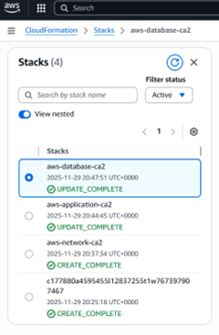
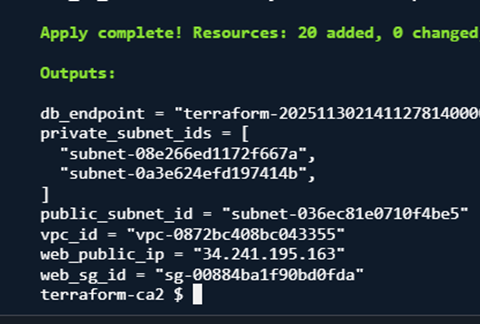
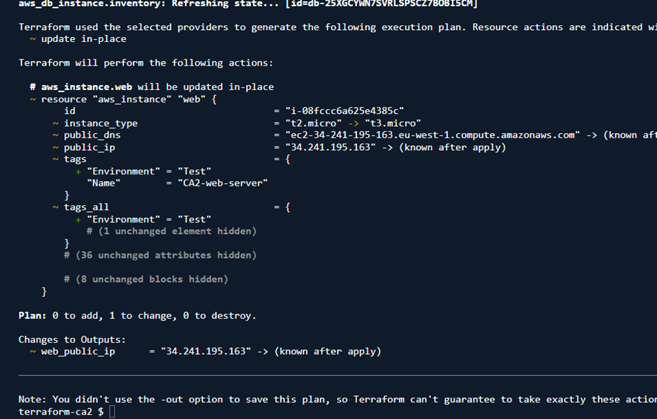
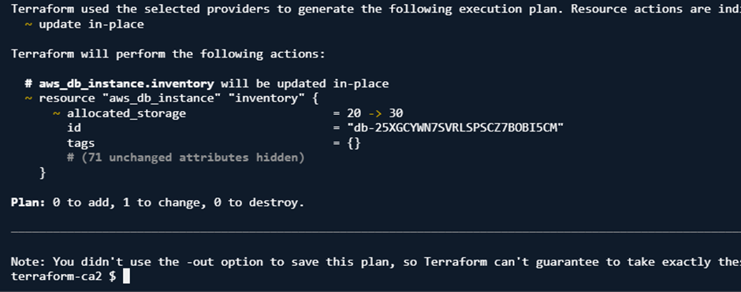
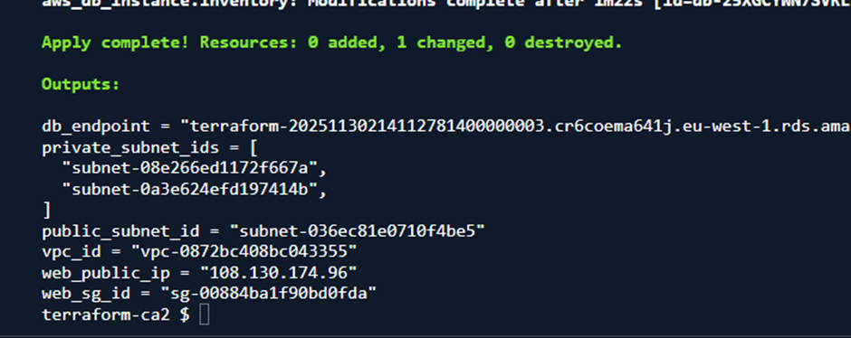

# Infrastructure Evidence

Consistent sizing and clearer captions for each screenshot. All images are scaled to the same width.

## A – Cloud Application Architecture Diagram

  

_Figure A1 – Three-tier architecture across two Availability Zones with a public EC2 web tier and a private RDS database._

## B – CloudFormation Deployment Evidence

  

_Figure B1 – Network stack (`aws-network-ca2`) created successfully._

  

_Figure B2 – Application stack (`aws-application-ca2`) created successfully._

  

_Figure B3 – Database stack (`aws-database-ca2`) created successfully._

  

_Figure B4 – Public URL of the EC2 instance showing the Apache-hosted multi-tier confirmation page._

## C – CloudFormation Update Evidence

  

_Figure C1 – EC2 instance type and tag update applied via CloudFormation._

  

_Figure C2 – RDS allocated storage increased from 20 GB to 30 GB using ModifyDBInstance._

## D – Terraform Deployment Evidence

  

_Figure D1 – `terraform init` completed with provider installation._

  

_Figure D2 – `terraform plan` showing resources for the three-tier architecture._

  

_Figure D3 – `terraform apply` created 20 resources including VPC, EC2, and RDS._

  
  

_Figure D4 – Terraform output variables: VPC ID, subnet IDs, RDS endpoint, and web public IP._

## E – Terraform Update Evidence

  

_Figure E1 – `terraform plan` for EC2 update from t2.micro to t3.micro with tag adjustment._

  

_Figure E2 – `terraform apply` confirms EC2 update completed and new public IP assigned._

  

_Figure E3 – `terraform plan` for RDS storage increase from 20 GB to 30 GB._

  

_Figure E4 – `terraform apply` confirms RDS storage modification completed._
